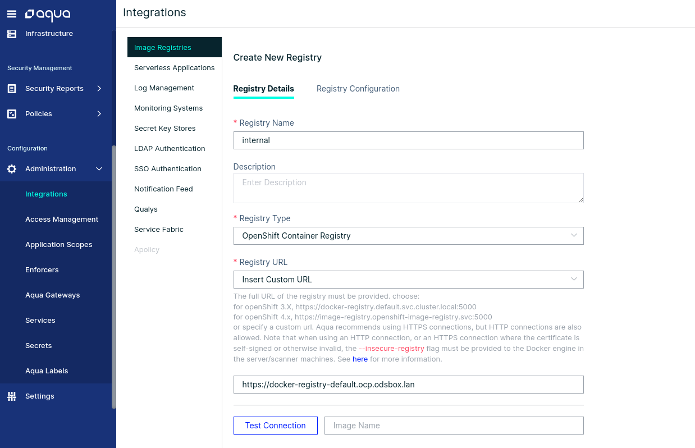

# Aqua Installation
Aqua is a thirparty tool to ensure the security of cloud native applications based in containers.  
Aqua scans container images based on a constantly updated stream of aggregate sources of vulnerability data (CVEs, vendor advisories, and proprietary research), which ensures up-to-date, broad coverage while minimizing false positives. Additionally, find malware, embedded secrets, OSS licenses, and configuration issues in your images to further reduce the attack surface.

As this third party tool is a propietary one that needs specific licences we provide a way to install in the odsbox the minimun needed components to be able to scan the images without the external access to an Aqua installation.

By default this tool is not installed in the boxes to reduces the memory and disk usage that will lead to a loose of performance.

## Installing aqua
Prerequisites:
- A valid user for Aqua
- A license of Aqua to install the tool (it can be found in https://success.aquasec.com/)  

In the folder ```ods-core/ods-devenv/scripts/aqua``` you'll find the script ```ìnstall-aqua.sh``` that will ask you for user, password and email of aqua. This script will create an *aqua* namespace and will install Aqua there.

After the installation you have to add your license token, and the internal registry of this instance of openshift in order to be able to scan the images generated in openshift. Currently the registry is: ```https://docker-registry-default.ocp.odsbox.lan``` 

This url can be retrieved using the oc cli: ```oc get routes -n default```.

By default this installation will create an admin user with name *administrator* and password *OpenShift3.*

### Adding the registry
To add the registry, first you'll need to login in the aqua dashboard (by default: http://aqua-web-aqua.ocp.odsbox.lan/)  
In the Administration -> Integrations section you can add a new registry with the parameters:
- Registry Name: internal
- Registry Type: Openshift Container Registry
- Registry URL: Insert Custom Url
- Custom URL: https://docker-registry-default.ocp.odsbox.lan



Now you can test the connection and save the registry.


